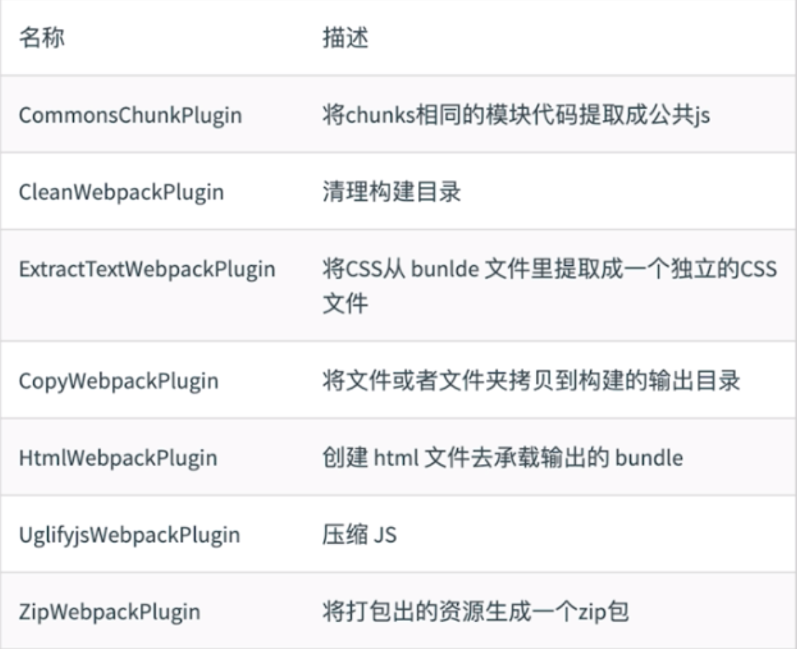

## Loaders
> webpack 开箱即用只支持JS和JSON两种格式，通过loader去支持其他文件类型并且把他们转化为有效的模块，并且可以添加到依赖图中。

loader本身是一个函数，接受源文件为参数，返回转换的结果

### 常见的loader有

名称 | 描述
---|---
bable-loader | 转换ES6/ES7等新特性语法
css-loader	 | 支持.css 文件的加载和解析
less-loader	 | 将less文件转换为css
ts-loader	 | 将TS转换为JS
file-loader	 | 进行图片、字体的打包
raw-loader	 | 将文件以字符串的形式导入
thread-loader| 多进程打包JS和CSS


###  Loaders 的用法
```js
// 配置示例
const path = require('path');
module.exports = {
    output: {
        filename: 'bundle.js'
    },
    module: {
        rules: [{
            test: /\.txt$/,          // test 指定匹配规则
            use: 'raw-loader'  // use 指定使用的 loader 名称
        }]
    }
};
```

## Plugins
> 插件用于bundle文件的优化，资源管理和环境变量注入，作用于整个构建过程

### 常见的plugins



### Plugins 的用法

```js
const path = require('path');
module.exports = {
    output: {
        filename: 'bundle.js'
    },
    plugins: [  // 放在plugins 数组中
        new HtmlWebpackPlugin({
            template: './src/index.html'
        })
    ]
};

```js