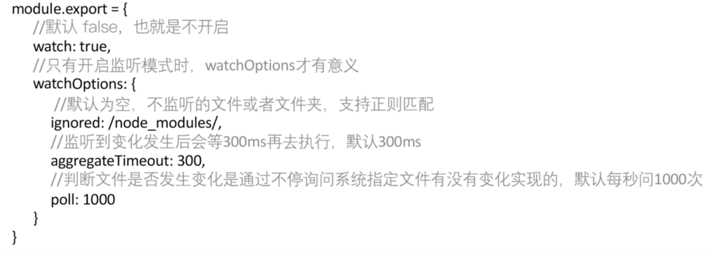
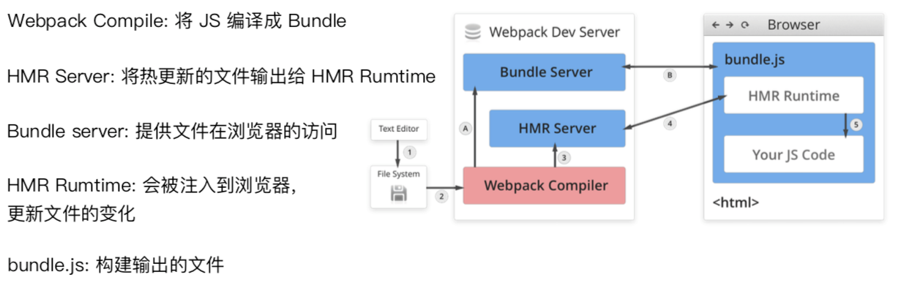

## 文件监听
> 文件监听是在发现源码发生变化时，⾃动重新构建出新的输出文件。

webpack 开启监听模式，有两种⽅式:

1. 启动 webpack 命令时，带上 --watch 参数
2. 在配置 webpack.config.js 中设置 watch: true

使用:
```js
{
    "name": "hello-webpack", 
    "version": "1.0.0", 
    "description": "Hello webpack", 
    "main": "index.js",
    "scripts": {
        "build": "webpack ",
        "watch": "webpack --watch"
    },
    "keywords": [], 
    "author": "", 
    "license": "ISC"
}
```




监听原理分析：轮询判断⽂件的最后编辑时间是否变化，某个文件发生了变化，并不会立刻告诉监听者，⽽是先缓存起来，等 aggregateTimeout

## 热更新之 webpack-dev-server
- WDS 不刷新浏览器器
- WDS 不输出⽂件，而是放在内存中
使⽤ HotModuleReplacementPlugin插件
```js
{
    "name": "hello-webpack",
    "version": "1.0.0",
    "description": "Hello webpack",
    "main": "index.js",
    "scripts": {
        "build": "webpack ",
        "dev": "webpack - dev - server--open"
    },
    "keywords": [],
    "author": "",
    "license": "ISC"
}
```

## 热更新之 webpack-dev-middleware
> WDM 将 webpack 输出的文件传输给服务器器，适⽤用于灵活的定制场景
```js
const express = require('express');
const webpack = require('webpack');
const webpackDevMiddleware = require('webpack-dev- middleware');
const app = express();
const config = require('./webpack.config.js'); const compiler = webpack(config);
app.use(webpackDevMiddleware(compiler, { 
  publicPath: config.output.publicPath
}));
app.listen(3000, function () {
  console.log('Example app listening on port 3000!\n');
});

```

### 热更新的原理解析
