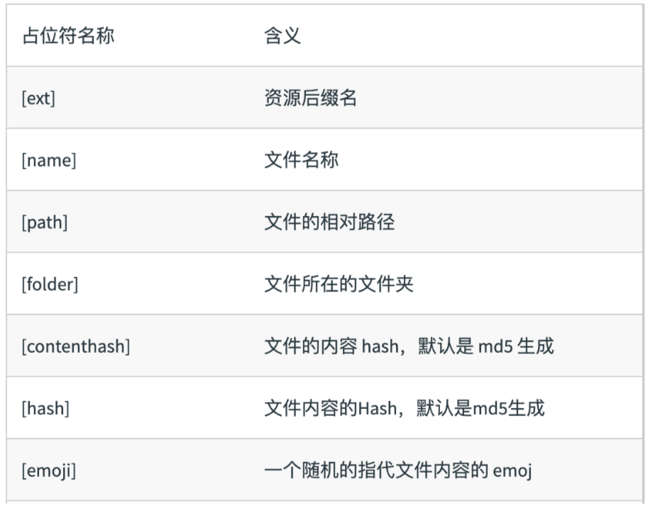

## 文件指纹
- Hash: 和整个项目的构建有关，只要项目的文件有修改，整个项目构建的 hash 值就会更改
- ChunkHash：和 webpack 打包的 chunk 有关，不同的 entry 会生成不同的 chunkhash 值
- Contenthash：根据文件的内容来定义 hash，文件内容不变，则 contenthash 不变

### JS 的文件指纹
设置 output 的 filename，使用 chunkhash
```js
module.exports = {
    entry: {
        index: './src/index.js',
        search: './src/search.js'
    },
    output: {
        path: path.join(__dirname, 'dist'),
        filename: '[name][chunkhash:8].js'
    }
};
```

### CSS 文件指纹
设置MiniCssExtractPlugin的filename，使用contenthash

```js
module.exports = {
    entry: {
        index: './src/index.js',
        search: './src/search.js'
    },
    output: {
        path: path.join(__dirname, 'dist'),
        filename: '[name][chunkhash:8].js'
    },
    plugins:[
        new MiniCssExtractPlugin({
            filename: '[name]_[contenthash:8].css'
        })
    ]
};
```

### 图片文件的指纹设置
设置 file-loader 的filename，使用【hash】

```js
module.exports = {
    entry: {
        index: './src/index.js',
        search: './src/search.js'
    },
    output: {
        path: path.join(__dirname, 'dist'),
        filename: '[name].js'
    },
    mode: 'development',
    module: {
        rules: [
            {
                test: /.(png|jpg|gif|jpeg)$/,
                use: [
                    {
                        loader: 'url-loader',
                        options: {
                            name: 'img/[name][hash:8].[ext]'
                        }
                    }
                ]
            }
    },

};
```
