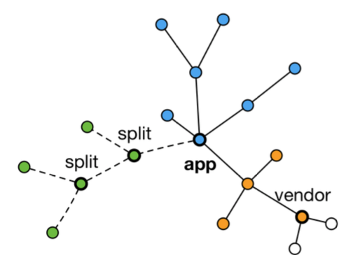
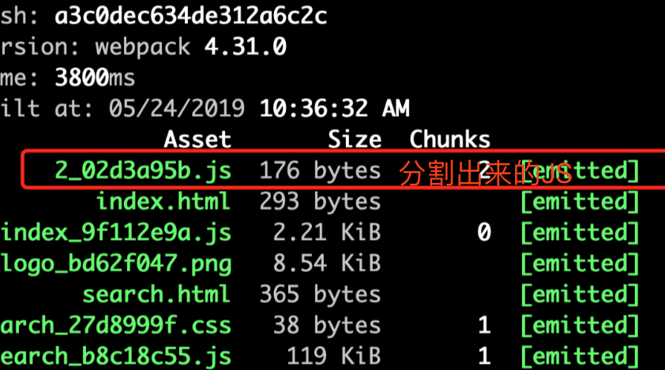

## 代码分割和动态import
> 对于大的Web应用来讲，将所有的代码都放在一个文件中显然不够有效的，特别是当你的某些代码块是在某些特殊情景下才会被使用到。webpack有一个功能就是将你的代码库分割成chunks（语块），当代码运行到需要它们的时候再进行加载。

### 适用场景

- 抽离相同代码到一个共享块
- 脚本懒加载，使得初始下载的代码更小



### 懒加载 JS 脚本的方式（用到这个脚本再加载它）

- CommonJS：require.ensure
- ES6：动态import（目前没有原生支持，需要babel转换）

### 如何使用动态import

1. 安装 babel 插件

```js
$ npm install @babel/plugin-syntax-dynamic-import --save-dev

```

2. ES6：动态import

```js
// .babelrc 文件配置
{
    'plugins:['@babel/plugin-syntax-dynamic-import']'
}

```

### 代码分割效果

```js

import React from 'react';
import ReactDOM from 'react-dom';
import largeNumber from 'large-number';
import logo from './images/logo.png';
import './search.less';

class Search extends React.Component {

    constructor() {
        super(...arguments);

        this.state = {
            Text: null
        };
    }
    // 动态import 关键代码
    loadComponent() {
        import('./text.js').then((Text) => {
            this.setState({
                Text: Text.default
            });
        });
    }

    render() {
        const { Text } = this.state;
        const addResult = largeNumber('999', '1');
        return <div className="search-text">
            {
                Text ? <Text /> : null
            }
            { addResult }
            搜索文字的内容
        </div>;
    }
}

ReactDOM.render(
    <Search />,
    document.getElementById('root')
);

```

