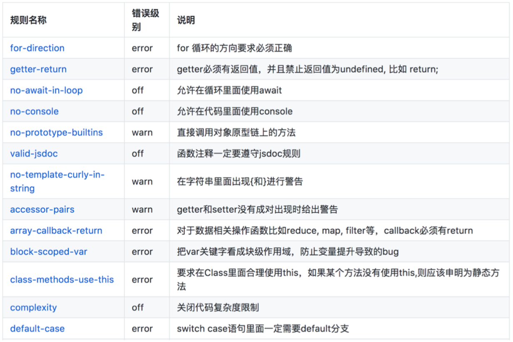
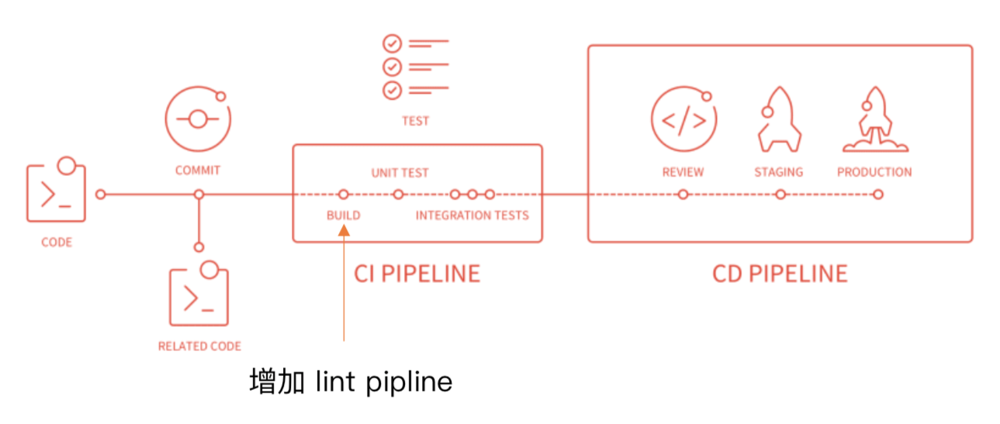

## webpack 和ESLint 结合
### 行业里面优秀的 ESLint 规范实践

[ESLint 中文官网](https://cn.eslint.org/docs/user-guide/configuring)

Airbnb: eslint-config-airbnb、 eslint-config-airbnb-base

腾讯

1. alloyteam团队 [eslint-config-alloy](https://github.com/AlloyTeam/eslint-config-alloy)
2. ivweb 团队: [eslint-config-ivweb](https://github.com/feflow/eslint-config-ivweb)

### 指定团队的 ESLint 规范

1. 不重复造轮子，基于 eslint:recommend 配置并改进
2. 能够帮助发现代码错误的规则，全部开启
3. 帮助保持团队的代码风格统一，⽽不是限制开发体验


### 方案一：webpack 和 CI/CD 集成



### 本地开发阶段增加 precommit 钩子

1. 安装 husky
```js
$ npm install husky --save-dev
```
2. 增加 npm script，通过 lint-staged 增量检查修改的文件

```js
"scripts": {
    "precommit": "lint-staged"
}, 
"lint-staged": {
    "linters": {
        "*.{js,scss}": ["eslint --fix", "git add"] 
    }
}

```

### 方案二：webpack 和 ESLint 集成

使用 eslint-loader，构建时检查 JS 规范

```js
module.exports = {
    module: {
        rules: [{
                test: /\.js$/,
                exclude: /node_modules/,
                use: [
                    "babel-loader",
                    "eslint-loader"
                ]
            }
        };
    ]
}
```

.eslintrc.js 文件配置

```js
module.exports = {
    "parser": "babel-eslint",  // 解释器
    "extends": "airbnb",       // 继承airbnb规则
    "env": {                   // 设置环境，当前设置了浏览器和node环境
        "browser": true,
        "node": true
    },
    "rules": {
        "indent": ["error", 4]
    }
};
```