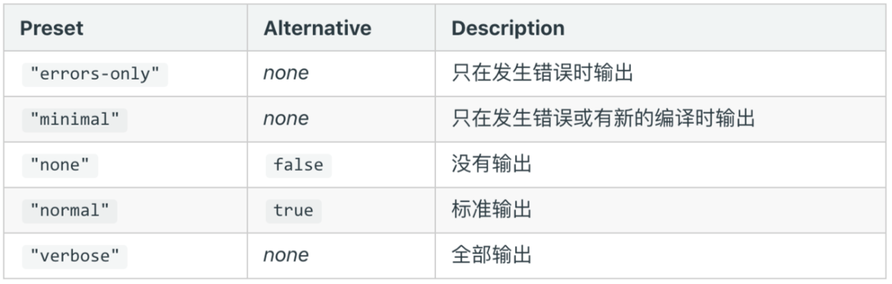

## 优化构建时命令行的显示日志
webpack 打包展示一堆日志，很多并不需要开发者关注

### 统计信息 stats



### 优化命令行的构建日志

使用 friendly-errors-webpack-plugin 插件

- success: 构建成功的日志提醒
- warning: 构建警告的日志提示
- error: 构建报错的日志提示

```js
module.exports = { 
    entry: {
        app: './src/app.js',
        search: './src/search.js' 
    },
    output: {
        filename: '[name][chunkhash:8].js', 
        path: __dirname + '/dist'
    },
    plugins: [
        new FriendlyErrorsWebpackPlugin()
    },
    stats: 'errors-only'   //  设置 stats
}

```