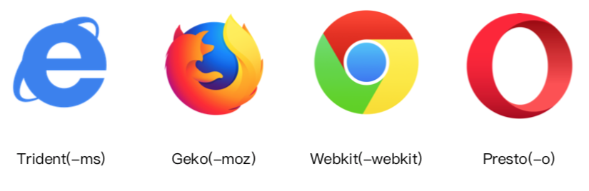

PostCSS 插件 autoprefixer 自动补齐 css3前缀
CSS3属性为什么需要前缀？

因为：浏览器内涵版本不一样



webpack 的PostCSS配置如下

```js
  module: {
        rules: [
            {
                test: /.less$/,
                use: [
                    MiniCssExtractPlugin.loader,
                    'css-loader',
                    'less-loader',
                    {
                        loader: 'postcss-loader',
                        options: {
                            plugins: () => [
                                require('autoprefixer')({
                                    browsers: ['last 2 version', '>1%', 'ios 7']
                                })
                            ]
                        }
                    }
                ]
            }
        ]
    },
```