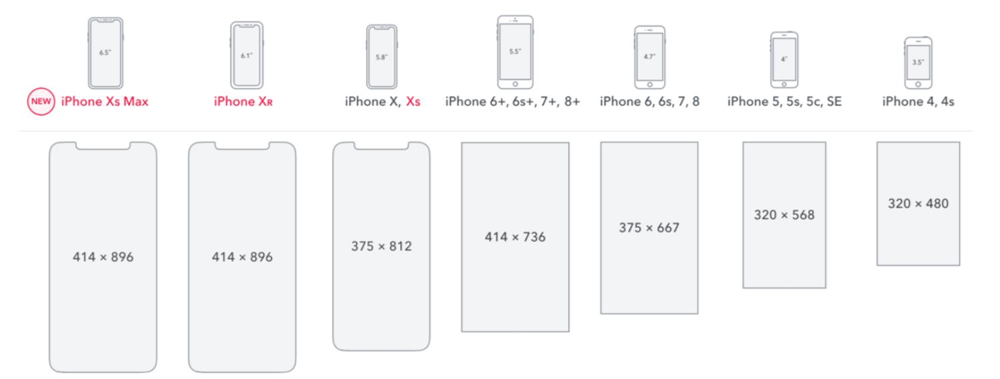

## 移动端 CSS px 自动转化成 rem
首先先看下移动端的浏览器分辨率



 px 自动装换成 rem可以使用 px2rem-loader，页面渲染时计算根元素的 font-size 值。也可以使用手淘的[lib-flexible](https://github.com/amfe/lib-flexible)插件

### webpack 配置如下

```js
module: {
    rules: [
        {
            test: /.less$/,
            use: [
                MiniCssExtractPlugin.loader,
                'css-loader',
                'less-loader',              
                {
                    loader: 'px2rem-loader',
                    options: {
                        remUnit: 75,   // 1rem = 75px
                        remPrecision: 8  // 小数点位数
                    }
                }
            ]
        }
    ]
},
```
### Lib-flexible
Lib-flexible 的源码， 短短不到一百行

动态的计算根元素的rem单位。

```js
(function flexible (window, document) {
  var docEl = document.documentElement

  //window.devicePixelRatio获取设备像素比（设备像素比 ＝ 物理像素 / 设备独立像素）
  var dpr = window.devicePixelRatio || 1 

  // adjust body font size
  // 根据 dpr 设置body 下的font-size
  function setBodyFontSize () {
    if (document.body) {
      document.body.style.fontSize = (12 * dpr) + 'px'
    }
    else {
      document.addEventListener('DOMContentLoaded', setBodyFontSize)
    }
  }
  setBodyFontSize();

  // set 1rem = viewWidth / 10
  // 根据页面宽度设置 rem 的单位
  function setRemUnit () {
    var rem = docEl.clientWidth / 10
    docEl.style.fontSize = rem + 'px'
  }

  setRemUnit()

  // reset rem unit on page resize
  //在窗口大小改变之后,就会触发resize事件.
  //当一条会话历史记录被执行的时候将会触发页面显示(pageshow)事件
  window.addEventListener('resize', setRemUnit)
  window.addEventListener('pageshow', function (e) {
    if (e.persisted) {
      setRemUnit()
    }
  })

  // detect 0.5px supports
  // 当dpr >=2的时候设置border为0.5px 
  if (dpr >= 2) {
    var fakeBody = document.createElement('body')
    var testElement = document.createElement('div')
    testElement.style.border = '.5px solid transparent'
    fakeBody.appendChild(testElement)
    docEl.appendChild(fakeBody)
    if (testElement.offsetHeight === 1) {
      docEl.classList.add('hairlines')
    }
    docEl.removeChild(fakeBody)
  }
}(window, document))

```