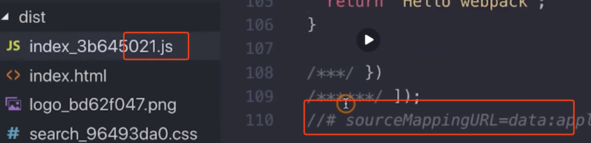

## source map 使用
source map 的作用是定位webpack打包之后的bundle文件的源码位置，科普请看这篇文章 [JavaScript Source Map 详解](http://www.ruanyifeng.com/blog/2013/01/javascript_source_map.html)

开发环境开启，线上环境关闭：线上排查问题的时候可以将sourcemap 上传到错误监控系统

### sourcemap 关键字

- eval: 使用eval包裹模块代码
- source mao: 产生 .map 文件
- cheap: 不包含列信息
- inline: 将 .map 作为DataUrl 嵌入，不单独生成 .map 文件
- module: 包含loader的sourcemap

 ### source map 类型

### eval 效果

eval 把模块代码包裹住，并且结尾使用 sourceURL 指向模块代码的文件

### source-map 效果
源文件和 .map 文件分开，源文件结尾有sourceMappingUrl 标志，如图

### inline-source-map 效果

文件不分离，把sourcemap inline进入了源文件，源文件大小变大。

