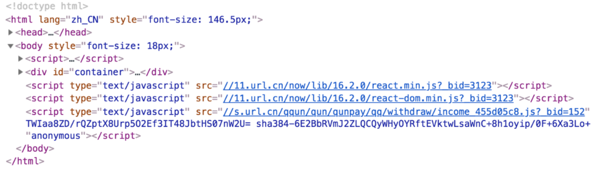

## webpack 提取公共资源
基础库分离：React示例

思路：将react、react-dom 基础包通过cdn引入，不打入bundle

方法：使用html-webpack-extends-plugin

```js
const HtmlWebpackExternalsPlugin = require('html-webpack-externals-plugin');
plugins: [
    new HtmlWebpackExternalsPlugin({
        externals: [
          {
            module: 'react',
            entry: 'https://11.url.cn/now/lib/16.2.0/react.min.js',
            global: 'React',
          },
          {
            module: 'react-dom',
            entry: 'https://11.url.cn/now/lib/16.2.0/react-dom.min.js',
            global: 'ReactDOM',
          },
        ]
    }),
]
```

效果如图


使用 SplitChunksPlugin 进行公共脚本分离

webpack4 内置的，替代 CommonsChunkPlugin（webpack3使用的多） 插件，SplitChunksPlugin介绍请参考官方文档

chunks参数说明：

- async: 异步引入的库进行分离（默认）
- initial: 同步引入的库进行分离
- all: 所以引入的库进行分离（推荐）

```js
module.exports = {
  //...
  optimization: {
    splitChunks: {
      chunks: 'async',
      minSize: 30000, // 分离包体积的大小
      maxSize: 0,
      minChunks: 2,    // 设置最小引用次数为2次
      maxAsyncRequests: 5,  
      maxInitialRequests: 3,
      automaticNameDelimiter: '~',
      automaticNameMaxLength: 30,
      name: true,
      cacheGroups: {
        vendors: {
          test: /[\\/]node_modules[\\/]/,  // 匹配出需要分离的包
          priority: -10
        },
        default: {
          minChunks: 2,
          priority: -20,
          reuseExistingChunk: true
        }
      }
    }
  }
};

```