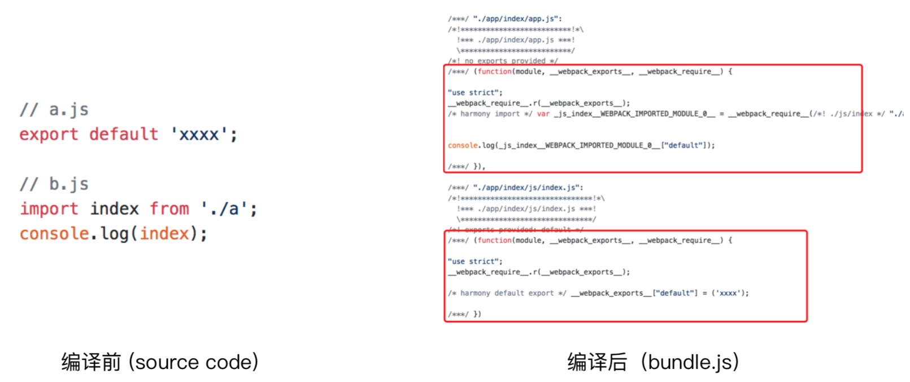
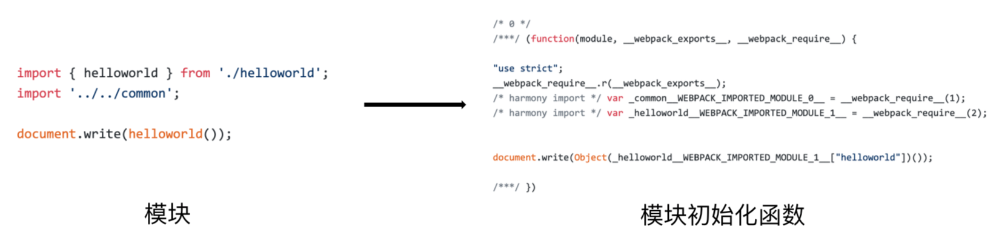
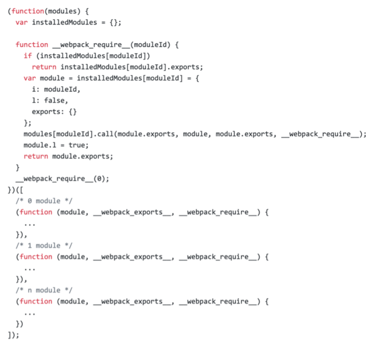
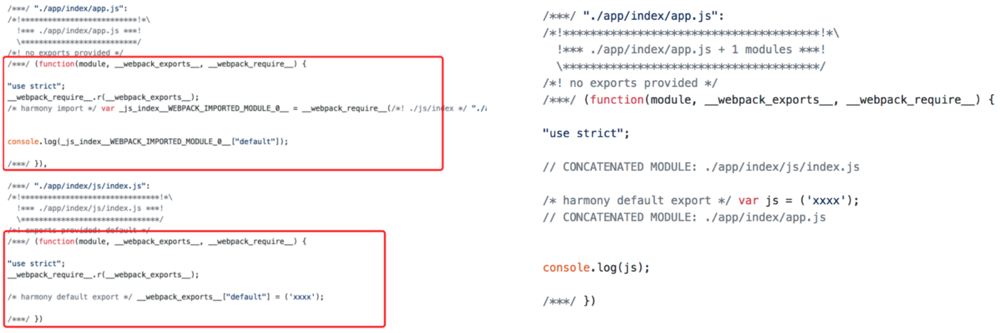
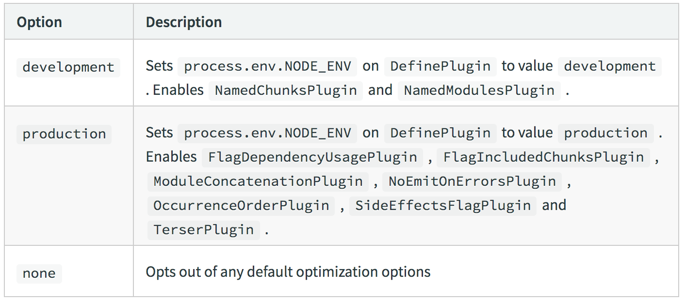

## Scope Hoisting 使用和原理分析
现象：构建后的代码存在大量的闭包代码



会导致什么问题？

- 大量函数闭包包裹代码，导致体积增大（模块越多越明显）
- 运行代码时创建的函数作用域变多，内存开销变大

webpack模块转换分析

如图



结论

- 被 webpack 转换后的模块会带一层包裹
- import 会被转换成 __webpack_require
进一步分析 webpack 的模块机制



分析以上代码

- 打包出来的是一个 IIFE（匿名闭包）
- modules 是一个数组，每一项是一个模块化初始化函数
- __webpack_require 用来加载模块，返回 module.exports
- 通过 WEBPACK_REQUIRE_MOTHOD(0) 启动程序

### scope hoisting 原理

原理：将所有的模块的代码按照引用顺序放在一个函数作用域里，然后适当的重命名一些变量以防止变量名冲突

对比：通过 scope hoisting 可以减少函数声明代码和内存开销



### scope hoisting 使用

- webpack mode 为production 默认开启
- 必须是 ES6 语法，CJS 不支持
可以参考官网对mode的描述，mode=production模式下自动开启FlagDependencyUsagePlugin , FlagIncludedChunksPlugin , ModuleConcatenationPlugin , NoEmitOnErrorsPlugin , OccurrenceOrderPlugin , SideEffectsFlagPlugin and TerserPlugin



```js
module.exports = { 
    entry: {
        app: './src/app.js',
        search: './src/search.js' 
    },
    output: {
        filename: '[name][chunkhash:8].js', 
        path: __dirname + '/dist'
    },
    plugins: [
        new webpack.optimize.ModuleConcatenationPlugin() 
    };
}

```